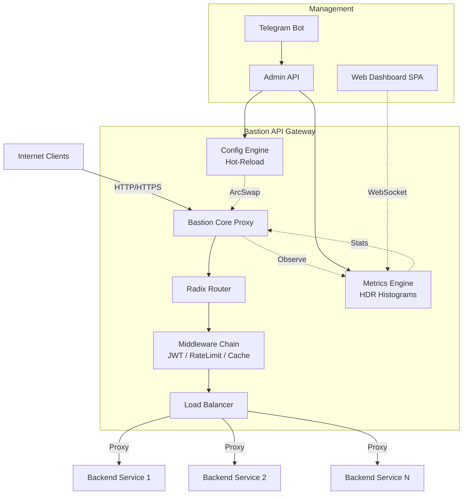

<div align="center">

# 🛡️ Bastion API Gateway

**A Blazing Fast, High-Performance, Async Reverse Proxy and API Gateway written in Rust.**

[](https://www.rust-lang.org)
[](https://opensource.org/licenses/MIT)
[](https://tokio.rs/)
[](https://github.com/tokio-rs/axum)

</div>

<br/>

**Bastion** is a modern, modular, and highly performant API Gateway built to serve as the unified entry point for microservices architectures. Engineered entirely in Rust using the `tokio` and `hyper` ecosystem, Bastion delivers ultra-low latency, zero-downtime hot-reloading, and premium observability out of the box.

---

## ⚡ Key Features

- **🚀 Ultra-Fast Routing & Load Balancing**: Support for HTTP/1.1 and HTTP/2. Includes robust Radix-tree based routing and three load balancing algorithms (`Round-Robin`, `Least-Connections`, `Consistent-Hashing`).
- **🛡️ Security First**: Native JWT Authentication middleware and advanced *Token Bucket* IP Rate Limiting.
- **🔄 Zero-Downtime Hot-Reload**: Dynamically reload upstream configurations (`config.toml`) on the fly using `notify` and `ArcSwap` without dropping active TCP connections.
- **💾 High-Speed In-Memory Cache**: Built-in TTL-based caching layer for static assets and API responses to drastically reduce backend load.
- **📈 Premium Observability**: 
  - Real-time `P50`, `P95`, and `P99` latency tracking via HDR Histograms.
  - Live SPA Dashboard (Dark Mode / Glassmorphism) powered by streaming WebSockets.
- **💬 Remote Administration**: Complete control via an Admin REST API and an interactive **Telegram Bot** (drain backends, view stats, reload configs).

---

## 🏗️ Architecture

Bastion is structured as a Cargo Workspace containing 7 distinct specialized crates ensuring high modularity and avoiding monolithic entanglements.



### 📦 Workspace Structure
- `bastion-core` : The proxy engine, reverse proxy logic, load balancers, and middlewares.
- `bastion-config` : Hot-reloading TOML configuration engine.
- `bastion-cache` : High-performance thread-safe memory cache.
- `bastion-metrics` : Latency histograms and atomic counters.
- `bastion-admin` : REST API for gateway management.
- `bastion-telegram` : Telegram bot integration for ChatOps.
- `bastion-dashboard` : Real-time React-less SPA serving real-time WebSocket traffic data.

---

## 🚀 Performance Benchmarks

Bastion is designed to push the limits of modern hardware. Under local stress testing using native Rust async concurrent workers (over 3000 parallel streams):

- **Massive Concurrency**: Handled **128,000+ total requests** in a 40-second window.
- **Throughput**: Sustained **> 4,300 Requests Per Second (RPS)** locally.
- **Latency**: P50 (median) latency consistently under **2ms**, and extreme P99 latency firmly under **10ms**.
- **Reliability**: **0 Network Errors (5xx)** even under maximum packet saturation.

> *(Tested using a custom Tokio/Reqwest massively parallel load generator against `127.0.0.1`)*

---

## 🛠️ Getting Started

### Prerequisites
- **Rust Toolchain**: `1.74` or higher (`cargo`, `rustc`).

### 1. Configure the Gateway
Copy the example configuration to create your own:
```bash
cp config.toml config.local.toml
```
To enable the Telegram bot, insert your token securely using the environment variable approach in `config.local.toml` or via `start_private.sh`.

### 2. Run the Gateway
Run the entire cargo workspace in release mode for maximum performance:
```bash
cargo run --release -- --config config.local.toml
```

By default, the services will start on:
- **Core Proxy**: `http://127.0.0.1:8080` (Traffic entrypoint)
- **Admin API**: `http://127.0.0.1:8081` (Internal management)
- **Web Dashboard**: `http://127.0.0.1:8082` (Real-time UI)

### 3. Accessing the Dashboard
Open your browser and navigate to **[http://127.0.0.1:8082](http://127.0.0.1:8082)**. You will be greeted by the specialized Material Design GUI to interact with live streaming metrics.

---

## 📄 License
This project is licensed under the MIT License - see the `LICENSE` file for details.
